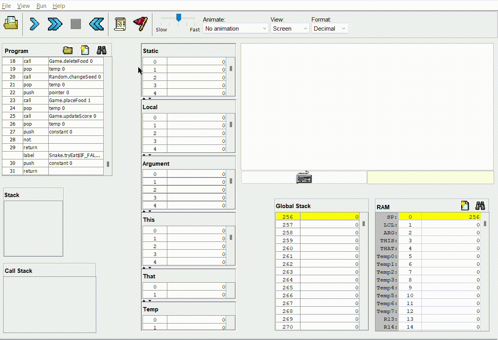
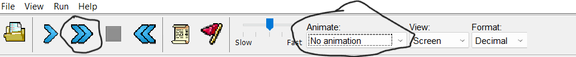

# The classic Snake game
Made using nand2tetris' jack programming language

## Overview
This is a classic snake game implementation in jack. It features 5 difficulty levels that determine the movement speed, a score counter and a basic food spawn randomizer. The game ends if the snake runs into a border or itself.

Move by using arrow keys.

## Running the game
1. download nand2tetris software package from [here](https://www.nand2tetris.org/software)
2. in the tools folder, run VMEmulator.
3. press the 'File' button in the top left corner and load the snake game folder
4. set 'Animate' to 'No animation' and press the blue double arrow to run the code

### To run the game again, press the
1. square
2. backward-pointing blue double arrow
3. forward-pointing blue double arrow

## Compiling the project
1. open nand2tetris' tools folder
2. put the snake game folder inside
3. open terminal from the tools folder and run `.\JackCompiler "<snake game folder name>"`

new VM files will show up in the snake game folder if successful.
